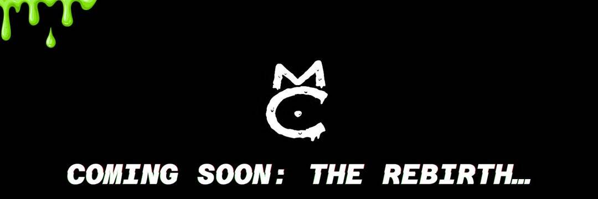

# MutantCats

Mutant Cats 是第一个购买和细分 Cool Cats 以分发给其成员的 DAO。9,999 只猫因以太坊区块链上的疾病而发生变异。通过质押获得 $FISH 被动收入并拥有 Cool Cats 保险库的一部分。

$FISH 代币代表金库中持有的 Cool Cats 的部分股份。每只 Mutant Cat NFT 每天通过质押赚取 10 条 FISH。此外，每个 Mutant Cat NFT 都授予对 DAO 独家社区的访问权和对 DAO 资产的投票权。Mutant Cat DAO 将为持有者提供对 NFT 投币、定期可索取的 NFT 以及更多未来实用程序的独家访问权限。

