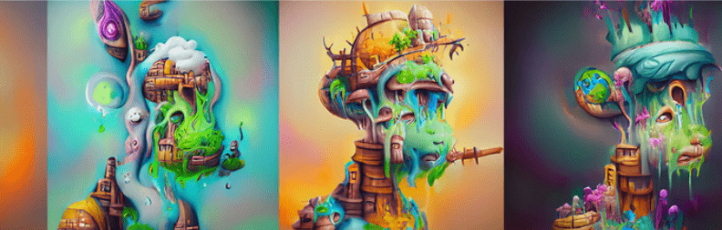

# MUTANTFLIP.ART

MutantFLIP 是 10,000 个 AI 生成的 MAYC 正在与元宇宙见过的最聪明的头脑一起进化……

MUTANTFLIP.ART NFT - 常见问题（FAQ）
▶ 什么是 MUTANTFLIP.ART？
MUTANTFLIP.ART 是一个 NFT（不可替代令牌）集合。存储在区块链上的数字艺术品集合。
▶ 有多少 MUTANTFLIP.ART 代币？
总共有 2,711 个 MUTANTFLIP.ART NFT。目前，210 位所有者的钱包中至少有一个 MUTANTFLIP.ART NTF。
▶ 最昂贵的 MUTANTFLIP.ART 销售是什么？
售出的最昂贵的 MUTANTFLIP.ART NFT 是 Mutant Flip #385。它于 2022 年 6 月 14 日（2 个月前）以 20.4 美元的价格售出。
▶ 最近卖出了多少 MUTANTFLIP.ART？
过去 30 天内售出了 1 个 MUTANTFLIP.ART NFT。

