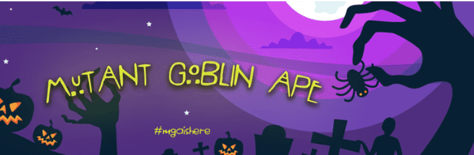

# mutantgoblinape

7777 FREAKIIINGGG MUTANT GOBLIN APES 已准备好从 GRAVESSSSSSSS 中走出来，与他们的 zumbiiii 朋友见面！我们不太确定这些疯子能做什么。上帝可能会给他们一些力量......

变种人goblinape NFT - 常见问题（FAQ）
▶ 什么是突变地精？
mutantgoblinape 是一个 NFT（非同质代币）集合。存储在区块链上的数字艺术品集合。
▶ 有多少个mutantgoblinape 代币？
总共有 7,776 个突变的 goblinape NFT。目前，1,994 名所有者的钱包中至少有一个突变地精 NTF。
▶ 最昂贵的突变地精销售是什么？
出售的最昂贵的mutantgoblinape NFT 是 #6073。它于 2022-06-18（2 个月前）以 54.8 美元的价格售出。
▶ 最近卖出了多少变异地精？
在过去的 30 天内，共售出 577 个mutantgoblinape NFT。
▶ 变异地精要多少钱？
在过去 30 天里，最便宜的mutantgoblinape NFT 销售额低于 2 美元，最高销售额超过 11 美元。过去 30 天内，mutantgoblinape NFT 的中位价格为 5 美元。
▶ 什么是流行的mutantgoblinape 替代品？
许多拥有mutantgoblinape NFT 的用户还拥有 MoonbirdsBatz、 Mutant MoonbirdsBatz、 Bored Ape Pixel Club v2和 Trolltown Mutational Elixirs。

