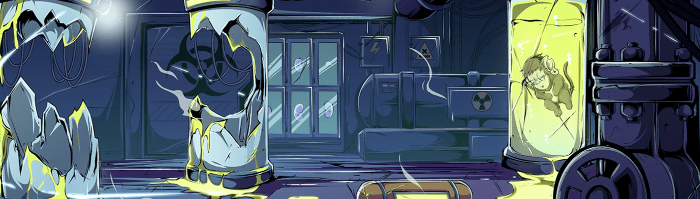

# Mutant KongZ Lab

3055, Derkein, 一个完整的 5000 Kongz 集合的二进制副本，由与 X 基因交叉的多个辐射突变创建，被插入到以太坊区块链中。为了解开实验背后的谜团，我们创建了一个名为 Mutant Kongz Lab 的社区。一群非常聪明和多元化的人试图破译私人服务器内的主要代码，但在尝试解决第一个问题时意外变异为 Alpha。与此同时，被召唤的Beta变种人在实验室外尖叫着，试图闯入。这是一切的开始，可能已经确定了结束。Mutant Kongz 是 5000 种生成艺术的集合，具有数千种组合。

