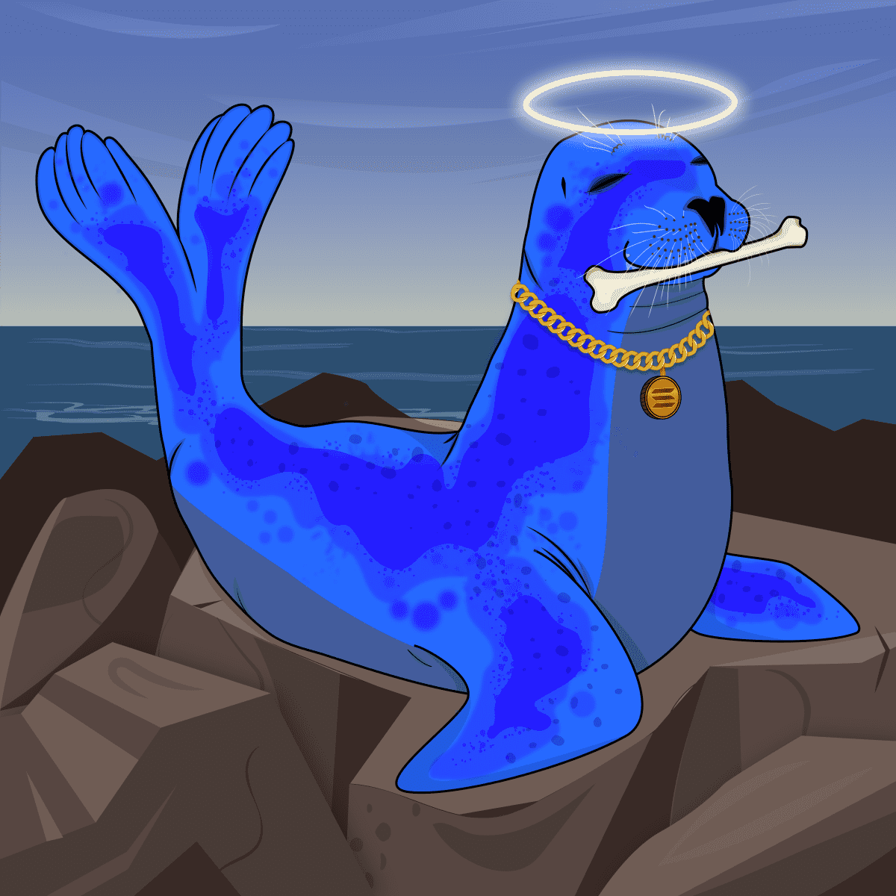

# Mutant Seals Club

过去，数以百万计的海狗因其宝贵的肉、鲸脂和毛皮而被杀死。在一些国家，海豹仍然大量死亡，因为渔民将鱼量减少归咎于它们。这使海豹成为濒临灭绝的物种。

突变是完全自然的事情，也是进化的一部分，在当今时代，污染量过高，化学泄漏、放射性废物等以不小心的方式处理正在以难以想象的方式影响各种物种，导致突变。

这些变异海豹获救，变异海豹俱乐部成立。Mutant Seals Club 是由程序生成的 10,420 个海豹的集合。我们仍在寻找以类似方式受到影响的其他物种，我们也会尽最大努力拯救它们。

