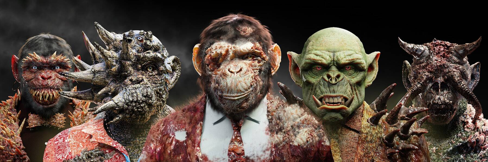

# Mutant Smart Beast Circle

在他们的第一个系列[Smart Beast](https://opensea.io/collection/smartbeastcircle)售罄后，设计师的一个实验室发生了一起化学事故，当时他们正在准备一项特殊资产以提高 Smart Beast 的效率。不幸的是，无数的灵兽被感染并变异为更强大、更不受控制的新一代，为它们的持有者提供了新的效用。

突变体灵兽圈NFT——常见问题（FAQ）
▶ 什么是变异灵兽圈？
Mutant Smart Beast Circle 是一个 NFT（Non-fungible token）集合。存储在区块链上的数字艺术品集合。
▶ 突变智能兽圈代币有多少？
总共有 858 个 Mutant Smart Beast Circle NFT。目前，366 位所有者的钱包中至少有一个 Mutant Smart Beast Circle NTF。
▶ 最昂贵的 Mutant Smart Beast Circle 促销活动是什么？
最昂贵的 Mutant Smart Beast Circle NFT 是 Mutant Smart Beast #756。它于 2022 年 6 月 26 日（2 个月前）以 393.2 美元的价格售出。
▶ 最近卖出了多少变异灵兽圈？
过去 30 天内共售出 29 个 Mutant Smart Beast Circle NFT。
▶ 突变灵兽圈要多少钱？
过去 30 天，最便宜的 Mutant Smart Beast Circle NFT 销售额低于 108 美元，最高销售额超过 272 美元。过去 30 天 Mutant Smart Beast Circle NFT 的中位价格为 197 美元。
▶ 什么是流行的 Mutant Smart Beast Circle 替代品？
许多拥有突变灵兽圈NFTs的用户还拥有 灵兽VIP卡、 佛陀兄弟-轮回通行证、 灵兽圈和 无聊猫起源。

