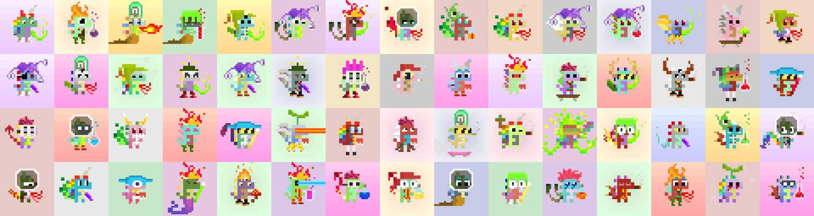

# Mutant Tiny Dinos (eth)

突变小恐龙🧪🦖 0xTinyDinos 的突变品种集合

Mutant Tiny Dinos (eth) NFT - 常见问题 (FAQ)
▶ 什么是突变小恐龙（eth）？
Mutant Tiny Dinos (eth) 是一个 NFT (Non-fungible token) 集合。存储在区块链上的数字艺术品集合。
▶ 有多少 Mutant Tiny Dinos (eth) 代币？
总共有 2,168 个 Mutant Tiny Dinos (eth) NFT。目前，246 位所有者的钱包中至少有一个 Mutant Tiny Dinos (eth) NTF。
▶ 最昂贵的 Mutant Tiny Dinos (eth) 销售是什么？
出售的最昂贵的 Mutant Tiny Dinos (eth) NFT 是 Mutant Tiny Dinos #939。它于 2022 年 6 月 26 日（2 个月前）以 11 美元的价格出售。
▶ 最近卖出了多少 Mutant Tiny Dinos (eth)？
过去 30 天内售出了 4 个 Mutant Tiny Dinos (eth) NFT。
▶ 什么是流行的 Mutant Tiny Dinos (eth) 替代品？
许多拥有 Mutant Tiny Dinos (eth) NFT 的用户还拥有 0xTinyDinos (eth)、 AI BoredApeYachtClub、 PixelatedGanjaGators和 Crypto BAYC。

