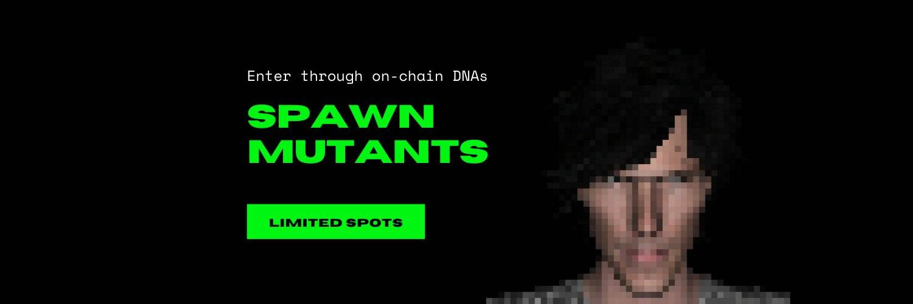

# MutantVerseDNA

MutantVerse 是在 N 的前提下构建的。一个由 8 个数字组成的随机序列。很像宇宙。我们正在启动 genesis dNA 作为接口，将使用该接口创建 MutantVerse。

我们使用 N 序列生成了包含 14 个独特属性的 dNA 元数据，它们用于创建多层链序列。在可视化和 dNA 核心方面，有多种属性组合会产生自然稀有性。

有哪些不同的属性以及它们如何帮助我们长期运行？
生成的属性的完整列表将在 OpenSea（发布后）上找到。但是，我们将推出一个仪表板来更好地管理您的 DNA。（见：路线图）

生成的属性是基于您的 N 序列与游戏权重一起考虑的。每个都会产生一组属性，这些属性定义如下：

内聚性、基因组间距、核苷高度、核苷间距、核苷厚度、序列混合角度等。

