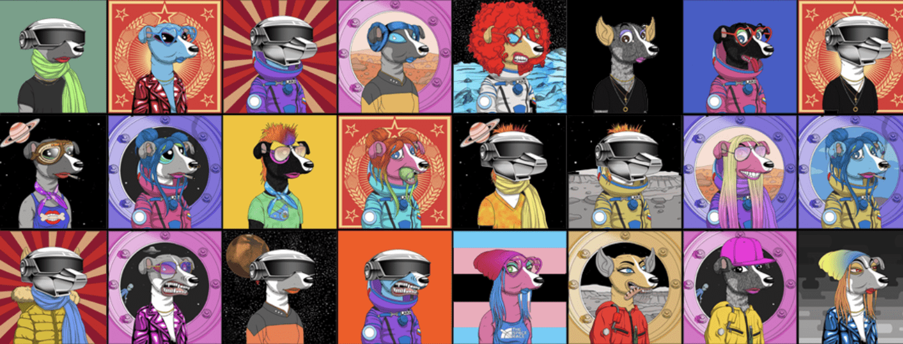

# Muttniks

Cosmic Paws 的创世纪系列“Muttniks”庆祝第一批飞入太空的狗的遗产和牺牲。我们的定制平台允许收藏家直接与我们的随机生成器互动，在那里他们铸造他们喜爱的 Muttnik。“Muttniks”的稀有度完全取决于创世代币购买者的集体铸币选择——Cosmic Paws 铸币过程的一个有趣特征。Cosmic Paws 于 2021 年 7 月 22 日发射，这是第一批在太空中飞行的犬科动物（Dezik 和 Tsygan）70 周年，Cosmic Paws 开始庆祝地球上最著名的 Muttnik “莱卡”，他是第一个在宇宙飞船中绕地球运行的生物。该系列将所有 Muttniks 的遗产提交到区块链上。

