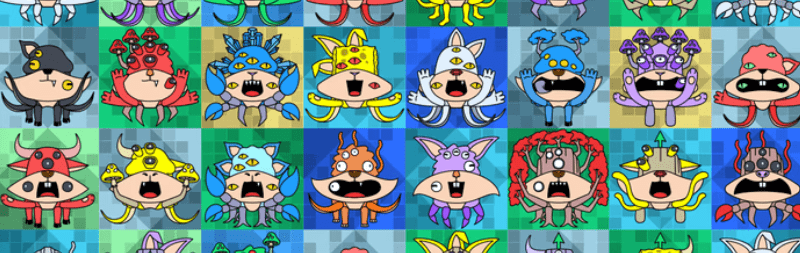

# Mutytes

Mutytes 是在以太坊区块链中漫游的 1,721 种严重变异生物的集合。完全去中心化，每一个 Mutyte 都是 100% 在链上生成、存储和渲染的。

一旦获得，Mutyte 将授予其所有者访问我们的秘密实验室、空投和自定义实用程序的权限。此外，Mutyte 令牌是可扩展的，这意味着它们可以进化和转换数百次！

加入我们的实验室，参与塑造 Ethernia 的未来！

哑巴
Mutytes 是 1,721 种严重变异的生物的集合。

所有 Mutytes 在铸造时都是 100% 在链上生成的。 拥有超过 20 种视觉特征、可生成的调色板和背景图案，每个 Mutyte 都是独一无二的。

在将 NFT 渲染为 SVG 图像时，我们利用自己量身定制的压缩技术来动态访问数百 KB 的数据。 这完全是在链上完成的，不依赖任何链下托管服务，使这个集合真正去中心化。

Mutytes 智能合约还实施了多种技术，可大大降低与铸造和转移代币相关的汽油费。

“这些生物和我见过的任何东西都不一样！ 有的看起来是双足的，有的有四只手臂，真的很恐怖。 我需要更多的数据来确定他们出现在埃瑟尼亚的原因！”

