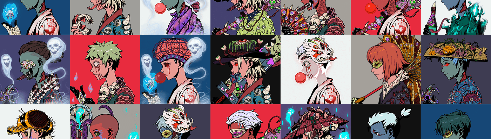

# Muzuki Official

Muzuki 官方 NFT - 常见问题（FAQ）
▶ 什么是Muzuki官员？
Muzuki Official 是一个 NFT（Non-fungible token）集合。存储在区块链上的数字艺术品集合。
▶ Muzuki 官方代币有多少？
总共有 808 个 Muzuki 官方 NFT。目前，197 位车主的钱包中至少有一个 Muzuki 官方 NTF。
▶ 最贵的 Muzuki 官方促销是什么？
售出的最昂贵的 Muzuki Official NFT 是 Muzuki #495。它于 2022-06-21（2 个月前）以 54.9 美元的价格售出。
▶ 最近卖了多少Muzuki Official？
过去 30 天内售出了 2 个 Muzuki 官方 NFT。
▶ 什么是流行的 Muzuki 官方替代品？
许多拥有 Muzuki Official NFT 的用户还拥有 Cozy Bears、 Monaka Official、 MGC NFT和 V2 Punks (Official)。

