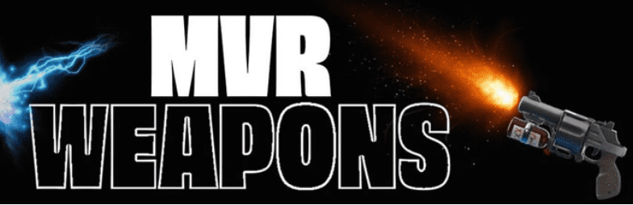

# Martians vs Rednecks Weapons

6,667 个 NFT 在 2022 年 3 月售罄。地球之战现已开始！了解最大的失败者故事是如何展开的。在被绑架并被带到太空进行“实验研究”数十年后，现在是红脖子反击的时候了……但他们会占上风吗？每个 NFT 都将有一个独特的 3D Avatar，准备好在虚幻引擎 4 和 5 中进行游戏，将于 2022 年第三季度推出。元界和 P2E 准备就绪。

▶ 什么是火星人VSRednecks？

MartiansVSRednecks 是一个 NFT（不可替代代币）集合。存储在区块链上的数字艺术品集合。

▶ 有多少个 MartiansVSRednecks 代币？

总共有 6,666 个 MartiansVSRednecks NFT。目前，853 位所有者的钱包中至少有一个 MartiansVSRednecks NTF。

