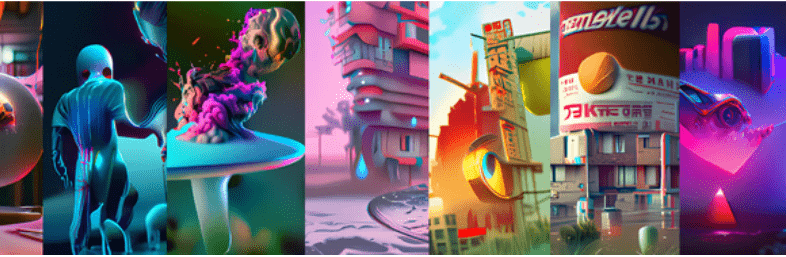

# MY BEAUTIFUL DARK TWlSTED FANTASY BY BEEBLE

BEEBLE BLOCKS 的创世纪系列。该系列是对 BEEBLE 独特风格的视觉美学中的超凡脱俗的城市景观和黑暗幻想的探索，带有迷幻色彩的抽象数字绘画。标题，指的是 Kanye West 的一张旧专辑，暗示了一个寻求逃避的困扰的心灵，在这一刻，我们不再能够区分什么是真实的和什么是幻想。

在这个生成艺术收藏中创建的算法和决策有意模仿 Beeple 在数字媒体上的方法 - 构图规则、调色板和整体主题。视觉元素的灵感来自 BEEBLE 游牧生活的记忆。你会发现一堆乱七八糟的药丸、从地平线升起的巨大的未来主义摩天大楼、红色气球的图案以及迷失自我的抽象表现——无论你感觉如何，这都是一种梦幻般的色彩景象。

