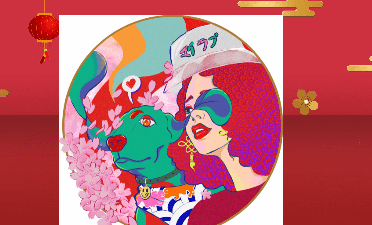

# My Buddy by Sandra Jockus (Mind Jungle)

每天都会带来许多不同的情绪和感受，无论好坏。这是一个充满明亮多彩的 NFT 的集合，每个都讲述了一个人和动物的故事，包括各种情感的表达和一些有趣的信息。

My Buddy by Sandra Jockus (Mind Jungle) NFT - 常见问题 (FAQ)
▶ Sandra Jockus (Mind Jungle) 的 My Buddy 是什么？
Sandra Jockus（Mind Jungle）的 My Buddy 是一个 NFT（非同质代币）集合。存储在区块链上的数字艺术品集合。
▶ 存在多少 My Buddy by Sandra Jockus (Mind Jungle) 代币？
Sandra Jockus (Mind Jungle) NFT 共有 178 个 My Buddy。目前，157 位所有者的钱包中至少有一个 Sandra Jockus (Mind Jungle) NTF 的 My Buddy。
▶ Sandra Jockus (Mind Jungle) 出售的 My Buddy 最贵的是什么？
Sandra Jockus (Mind Jungle) NFT 出售的最昂贵的 My Buddy 是 My Buddy No. 81。它于 2022 年 6 月 24 日（2 个月前）以 60.4 美元的价格售出。
▶ Sandra Jockus (Mind Jungle) 的 My Buddy 最近卖出了多少？
过去 30 天内售出了 1 个 Sandra Jockus (Mind Jungle) NFT 的 My Buddy。

