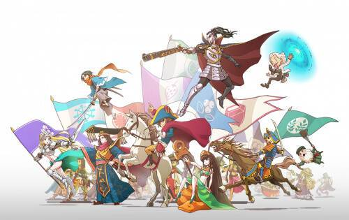

# My Crypto Heroes

My Crypto Heroes (MCH) 是一款基于以太坊和多边形区块链的多人角色扮演游戏。通过任务升级你的历史英雄，加入玩家与玩家的战斗，征服 MCH 世界。您的英雄和物品由区块链作为 ERC 721 令牌保护，而您会看到它们的价值随着您在游戏中的进步而增长。

**NFT 分为三种：**

- 英雄：历史英雄，玩任何内容都需要这些NFT。
- 扩展：可以设置为英雄的武器。每个英雄可以设置两个扩展，这些武器将使英雄变得更强大。
- 土地：拥有土地时，您有权获得收益分成。根据您的份额百分比，当属于同一土地的公民支付 ETH 以获得 GUM 时，您将获得 ETH。

**以下是主要内容：**

- 任务：与您的 NFT 英雄一起进行任务并获得宝箱。通过打开它，您可能会获得称为 Extension 的 NFT。
- 斗兽场：随时与其他玩家对战，提高斗兽场率。您赢得的位置越高，您可以获得的宝箱就越多。
- 神秘战争：与你的队友在你的土地上战斗，并获得分叉。取决于此内容的结果和您消耗的 Cp 量，您将获得的 MCHC 决定。
- 决斗杯：与其他玩家对战，以一般3天内的更高排名为目标。您在此内容中的排名越高，您可以获得的扩展稀有度越高。
