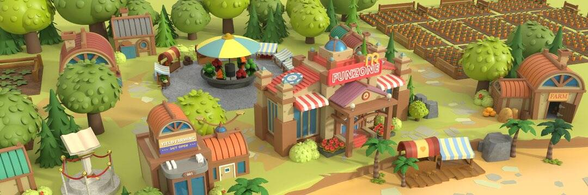

# MyRichFarm

My Rich Farm 是币安智能链上的一款农场游戏，其中 RCH 是游戏中唯一的代币。最大可能的 RCH 发行量将不超过 50 亿。我们计划使用智能合约将代币分配到 4 个部分，以确保 MY RICH FARM 的成功将为 RCH 带来价值。这样，我们可以支持玩家生态系统并获得市场增长和更多优质游戏的资源。

**RCH 的用途**

1.农场采购：

只有在私人账户中使用RCH，玩家才能在官方商店或市场购买农场。根据饲养的东西和配备的组件，同一类型的农场会产生不同的 RCH 产出和不同的回收期，因此这决定了农场在市场上的价值。

2.农场管理：

玩家在其农场的操作会消耗农场账户中的 RCH。作为回报，农场将产生 RCH。换句话说，NFT（农场）可以生产 RCH 代币。

3.基金：

该基金用于社区管理。提现时，系统会从总供应量中取出0.5%的RCH作为基金，用于开发基于RCH的社区游戏。资助的社区游戏将获得积极的反馈，为更多游戏创造更多机会。 

4.佣金：

将游戏账户中的 RCH 提现到私人账户时，将收取一定比例的佣金。 

5.烧币：

每笔交易产生的部分 RCH 佣金将被发送到燃烧池（一个专门的地址）。当池中的 RCH 累积到一定数量时，它们将被烧毁（或销毁）。
