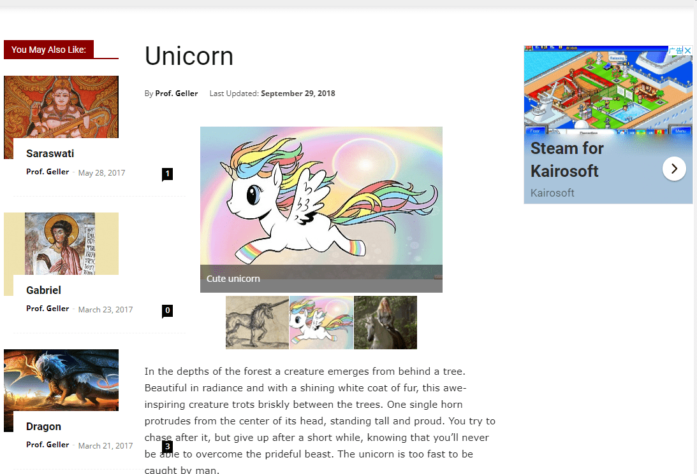

# MysticalUnicorns

中国*神话*-独角兽*是一种传说中的生物，自古以来*就被描述为一种具有单个大而尖的螺旋角的野兽......独角兽是最著名的*神话**生物*之一，通常被描绘成一匹白马，额头上长着一个螺旋状的角。尽管从技术上讲，*独角兽*可以是任何单角动物，但它几乎总是一种*神话般*的、类似马的野兽，其角伸出...*独角兽*的*神话*可能来自于目击羚羊和这种只有一个角的有蹄类动物，它们要么天生就有缺陷……丁语圣经将希腊语“monokeros”变成了“unicornis”。在公元 17 世纪，它出现在詹姆士国王版本的圣经中.....

