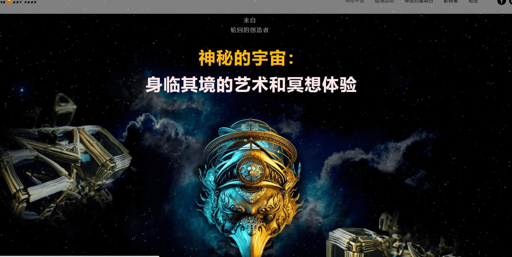

# MysticsUniverse OfficiaI

这种超越现实的描述以史诗的形式通过宗教、神话、神圣的绘画和建筑传给了我们——在神秘和美丽方面都引人注目。由于艺术与现代科技的结合，游客将能够**加入古代文明的知识**，看到重建的古代建筑遗迹，**解开神圣宇宙的秘密**。几千年来，神秘主义者和科学家们一直试图描绘宇宙的格局，从星空地图开始，到三头大象站在一只支撑地球的乌龟上结束。然而，人类历史上第一次，在计算机图形和动画的辅助下，我们可以**看到古代先贤的思想体现在现代艺术家的作品中**。一位有远见的艺术家，一位无畏探索人类想象中的精神奥秘的人。这位艺术家创作的数字艺术是来自其他维度的实体（恶魔、神灵和化身）图像与神圣符号和分形几何的迷幻混合物。

