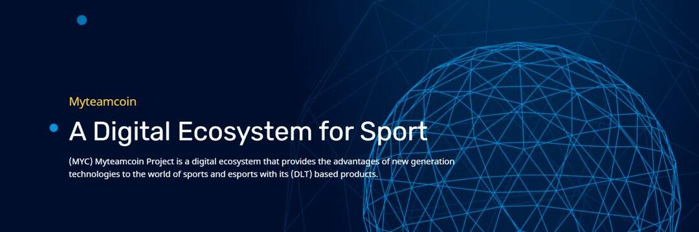

# MyTeamCoin

Myteamcoin 是一个区块链项目，由四个主要元素组成，以创新和革命性的视角为全球体育产业提供包容性解决方案。

Myteamcoin是领先的去中心化数字生态系统平台，旨在将区块链技术融入体育产业，填补全球体育产业在该领域的空白。目的是每个人都可以支持并轻松获得这项新技术的优势。

Myteamcoin 旨在通过最大化运动队、赞助商、球迷和体育行业投资者的经济收益来支持区块链技术和创新以实现其目标。为了实现这一目标，利用新一代区块链技术的优势使现有标准和经济模型多样化将是我们的首要任务。

