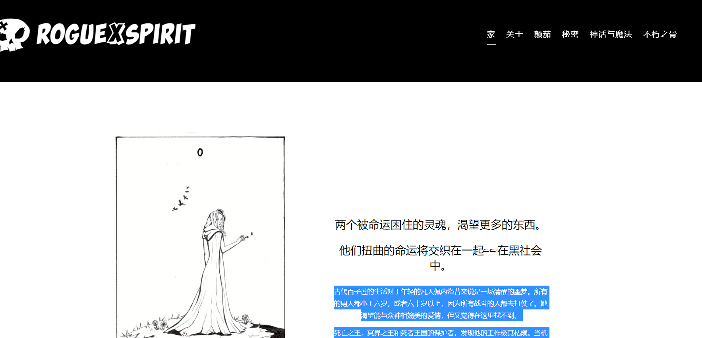

# Myth and Magic by Rogue

Myth and Magic 是 Rogue 的 1/1 合集，其中包含深入研究神话和魔法领域的委托作品和个人艺术品。该系列作品的持有者将每月收到一件独特艺术品的 3 个版本。此集合与 Belladonna 和 Secrets 是分开的，并且与该实用程序无关。古代百子莲的生活对于年轻的凡人佩内洛普来说是一场清醒的噩梦。所有的男人都小于六岁，或者六十岁以上，因为所有战斗的人都去打仗了。她渴望能与众神相媲美的爱情，但又觉得在这里找不到。死亡之王，冥界之王和死者王国的保护者，发现他的工作极其枯燥。当机会将佩内洛普带到死神之眼所及的空地时，他被迷住了，并决心让她成为他的女王。

