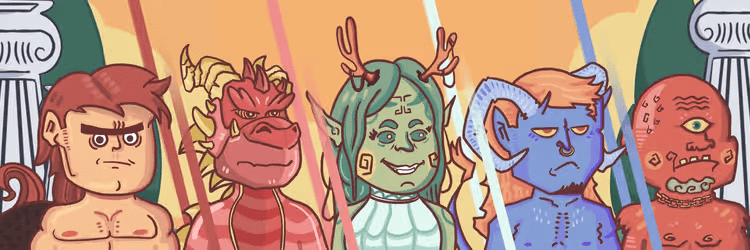

# Mythological Madness Genesis

3333 个 NFTS 的集合，将希腊神话生物带入 NFTS 领域。为 Collabs 联系我。*神话中的疯狂起源*。将希腊神话生物带入 NFTS 领域的 5555 个 NFTS 合集。看更多。展开更多3-4，希罗多德后来告诉我们国王的*疯狂*及其*起源*（6.75-84）。起初，他只提到了 Cleomenes在……之后变得*疯狂*的事实关于俄耳甫斯和欧律狄刻以及许多其他*神话*的信息。......这时他有了一个伟大但*疯狂*的想法：他决定去Under *神话*是一种民间传说类型，由在社会中发挥基本作用的叙事组成，例如基础故事或起源*神话*。World并且......

