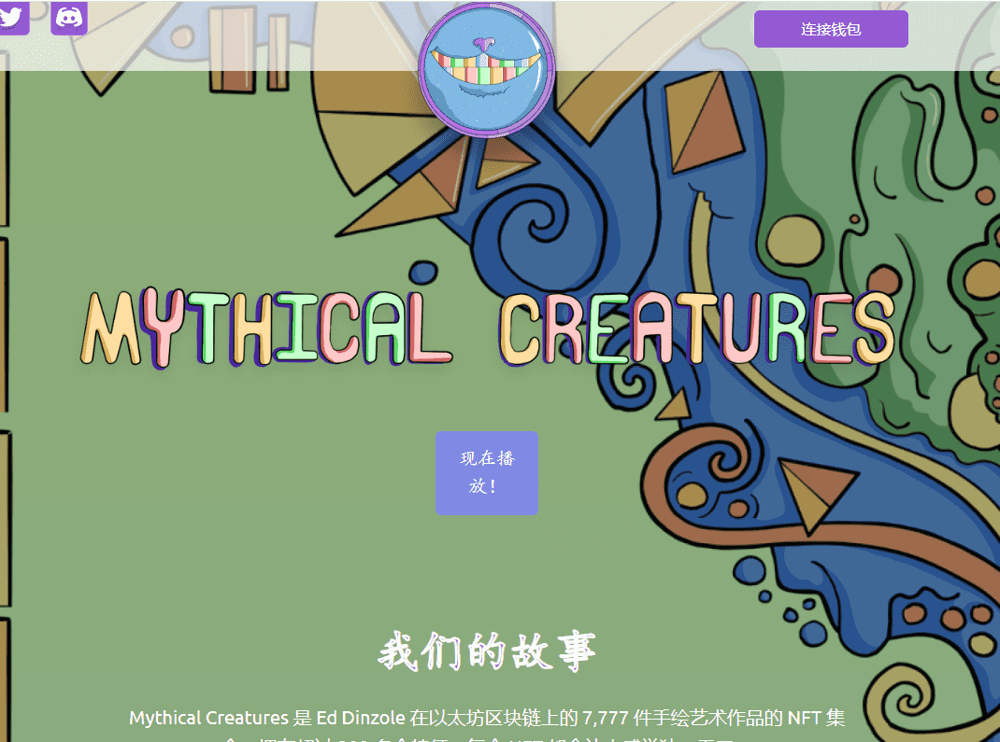

# Mythical Inhibitor

Mythical Creatures 是 Ed Dinzole 在以太坊区块链上的 7,777 件手绘艺术作品的 NFT 集合。拥有超过 300 多个特征，每个 NFT 都会让人感觉独一无二。穿越 Mythical Dreamland P2E 游戏赚取 $ALICE 代币。你会停下来寻求朋友的帮助，还是一个人去？社区建设。（进行中）有机营销增长策略。120个神话生物保留用于营销。白名单位置被分配给社区成员。赠品和社区挑战。7,777- Inception PFP NFT 将从未知中释放出来。7,777- 抑制剂可用于造币厂。神话般的梦境游戏以赚取游戏和 $ALICE 代币。书籍系列创作开始（系列中的 4-6 本书）。Inception PFP 持有者将收到每本书的 NFT。5个神话生物NFT将空投给随机持有者。社区钱包打开。社区钱包将用于创造长寿的各种机会。所有权和商业使用权与我们 NFT 的购买者共享。

