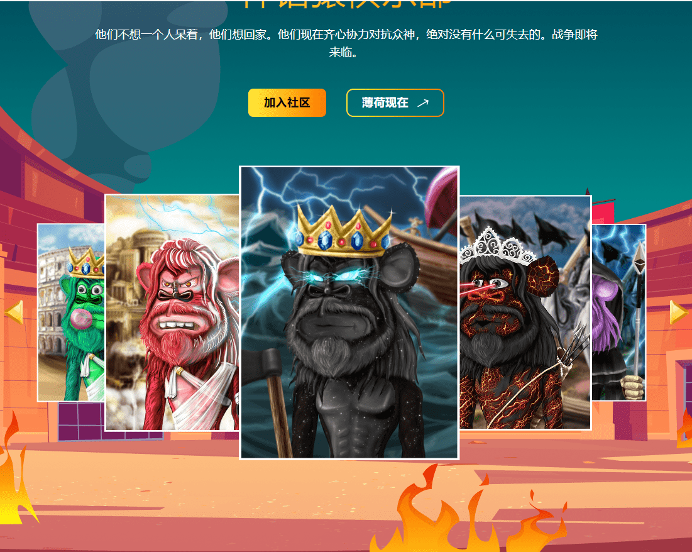

# Mythology Apes Club Official

他们不想一个人呆着，他们想回家。他们现在齐心协力对抗众神，绝对没有什么可失去的。战争即将来临。曾经天真地漫游在它们存在的平原上的 MAC 猿突然发现自己被陌生的建筑所包围。现代建筑已被白色大理石柱所取代，他们曾经被森林覆盖的家园现在是一片全新的景观，由古希腊人统治。

新的环境带来了新的威胁。希腊战士对他们的猿类冒名顶替者感到愤怒，他们是神话中的生物，眼中充满了饥渴。猿猴知道逃离这个环境并不容易——但他们必须尝试。他们用古希腊人使用的唯一可用的武器武装自己。他们挥舞着剑、矛和弓，准备拿起武器。他们计划先拿古希腊人。

