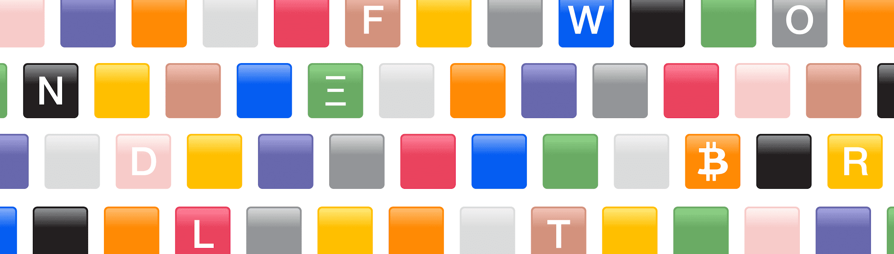

# My Wordle NFT

MyWordle NFT 是由病毒文字游戏 Wordle 的爱好者推出的 10,000 nft 的集合，团队正在*My Wordle NFT*是由病毒文字游戏 Wordle 的爱好者推出的 10,000 个独特 NFT 的集合，旨在庆祝视觉文化和想象力*My Wordle NFT*是存储在以太坊区块链上的 316 件 NFT 集合。*My Wordle NFT* NFT当前的底价为0.035 ETH - 59.21 美元。欢迎来到世界上第一个基于区块链的*Wordle*游戏。获取*Wordle NFT*来赚取 eth，玩*Wordle*来赚取 eth。*Wordle*是每个人都喜欢的病毒式游戏...2022年8月7日——Wordle*每天*发布新词。用户可以通过接受挑战来解决难题来玩这个游戏。这是最好的大脑游戏之一...

