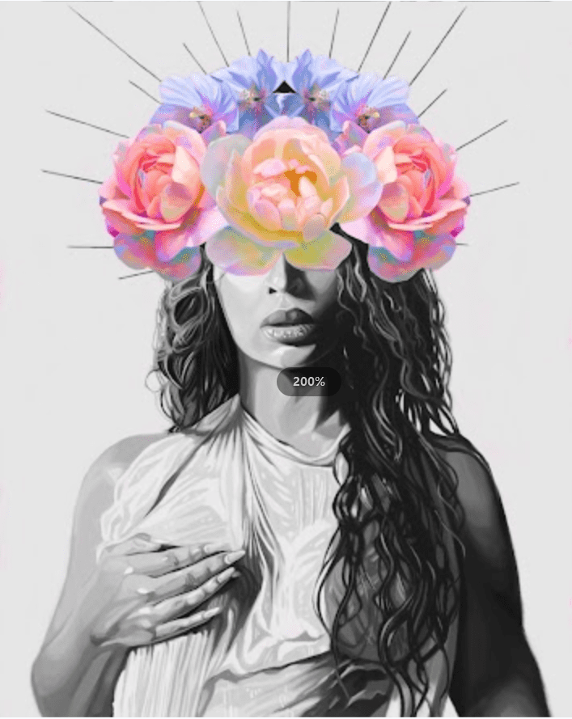

# N C H R O M A .

嗨，我是 Nashid Chroma，多伦多的数字流行艺术家。我的作品探索了匿名者和标志性者之间的界限。我通过我的社交媒体利用众包方法来挑选我的参考图像，以确保它们是最具标志性的，然后用花朵、几何和故障形状等主题来掩盖主题。这些装饰品充满了意义——比如图标的原产地——或者基于我在体验它们的表现时的感觉。最后，使用强烈饱和的颜色作为美学锚，将我的作品与一个有凝聚力的系列联系起来。这组作品是我一些最受欢迎的作品的限量版 NFT 合集！

