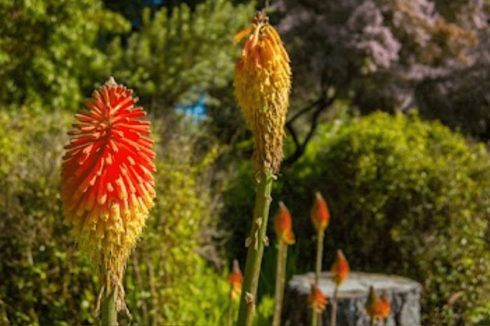

# Nature is Healing - Rudini

但人类是一群足智多谋的人，面对这种毁灭性的失望，一个新的模因诞生了：“*大自然正在治愈*，我们是病毒。*自然正在治愈*”模因：Twitter 取笑封锁期间减少污染的夸张故事。网民正在通过模仿病毒推文来反击关于自然如何在冠状病毒大流行*中治愈的假新闻。*几项新研究试图计算由于去年世界各地的封锁而对环境造成的成本和收益...在世界环境日，让我们来看看大流行病和限制人类活动如何有利于动植物和...缺少字词： Rudini ‎| 必须包含： 用*大自然的治愈*力量。农业、林业和其他土地利用占温室气体排放量的

