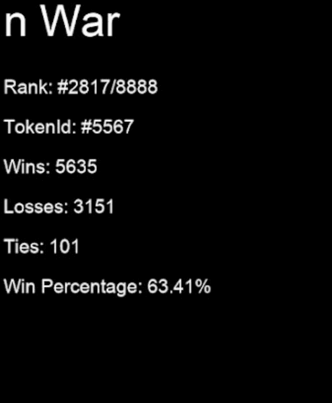

# n War

n War是一款基于War纸牌游戏的NFT。NFT 包含基于模拟纸牌游戏与其他 n 的统计和排名。针对所有其他 n 个数字对每个 n 运行模拟。这意味着每个 n 被“玩”了 8887 次以确定它与所有其他 n 的排名，这导致了大约 8000 万场比赛。

NFT 显示有关模拟的统计数据，并且 n War 徽标和边框根据排名/稀有度进行颜色编码。排名：

- 1-5 是黄金/传奇

- 6-250 为紫色/史诗

- 251-1,000 为蓝色/稀有

- 1,001-2,500 为绿色/不常见

- 2,501-5,500 是白色/普通

- 5,501-8,883 为灰色/差

- 8,884-8,888 为红色/深渊

  

  
