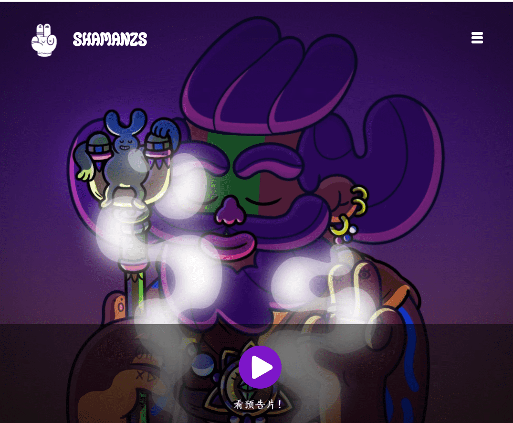

# Shamanzs NFT's

Shamanzs 是以太坊区块链上以编程方式随机生成的 9898 个 NFT 的原始集合。数以百计的特征都是手绘的，以创造出大量高品质和独特的爱心角色。

- 所有 Shamanz 都遵循 ERC721 NFT 标准。这意味着适应性和耐用性得到了保证。
- 该团队正在计划一项策略，以在铸造阶段提供尽可能多的分配。
- 每个 NFT 都将是您通往 Shamaverse 的秘密通行证，它将结合数字和物理世界的实用程序。

灵性土地上最睿智的僧侣、萨杜兹、戈兹和古鲁兹，无论他们属于哪个古老的宗教，都在暗中联手，打造强大的统一军团。他们的目标是传播爱和良好的共鸣，以一次性消除地球母亲的不良能量。一支新的萨满大军正在悄悄涌现，有史以来最大的追随者社区，即将以无限的正能量照亮整个虚拟世界。

来自不同部落、信仰、宗教、背景和性质的领袖正在融合在一个进化和升级的版本中；自称萨满。

萨满军团向全世界辐射的势不可挡的正能量，正吸引着沉睡的古神们的目光，谁知道接下来会发生什么……

