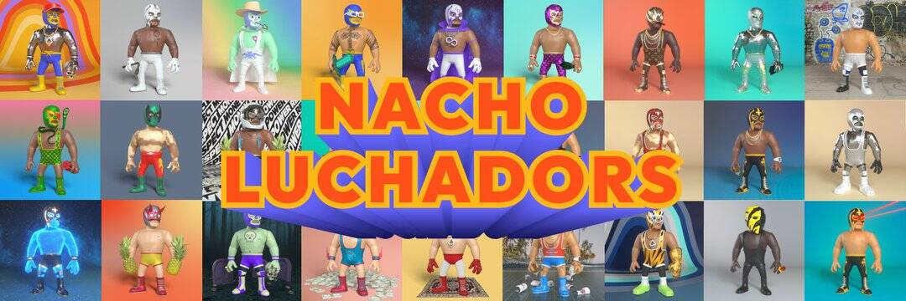

# Nacho Finance

Nacho Finance 的灵感来自 tomb.finance，是一种铸币税风格的算法稳定币协议，旨在为 Polygon 网络上的以太坊持有者带来高年利率和低费用。

Nacho Finance 是一个多代币协议，由以下三个代币组成：

- Nacho Token (NACHO) (交换媒介)

- Nacho Shares (NSHARE)（协议价值的治理和衡量）

- Nacho Bonds (NBOND)（在收缩期改变 NACHO 供应）

NACHO 算法代币是我们不断发展的生态系统的支柱，旨在为 Polygon 网络上的 ETH 持有者带来高 APR。该协议的底层机制动态调整 NACHO 的供应量，使其价格相对于 ETH 的价格上涨或下跌，以保持 NACHO 与 ETH 价格的挂钩。

NACHO 股票 (NSHARE)是衡量 NACHO 协议价值和股东信任其维持 NACHO 接近挂钩的能力的方法之一。在 epoch 扩展期间，协议铸造 NACHO 并将其按比例分配给所有在 Bowl 中质押其代币的 NSHARE 持有者。

此外，NSHARE 持有者对改进 NACHO 货币生态系统内的协议和未来用例的提案拥有投票权（治理）。

NACHO 债券 (NBOND)的主要工作是帮助激励时期收缩期间 NACHO 供应的变化。
