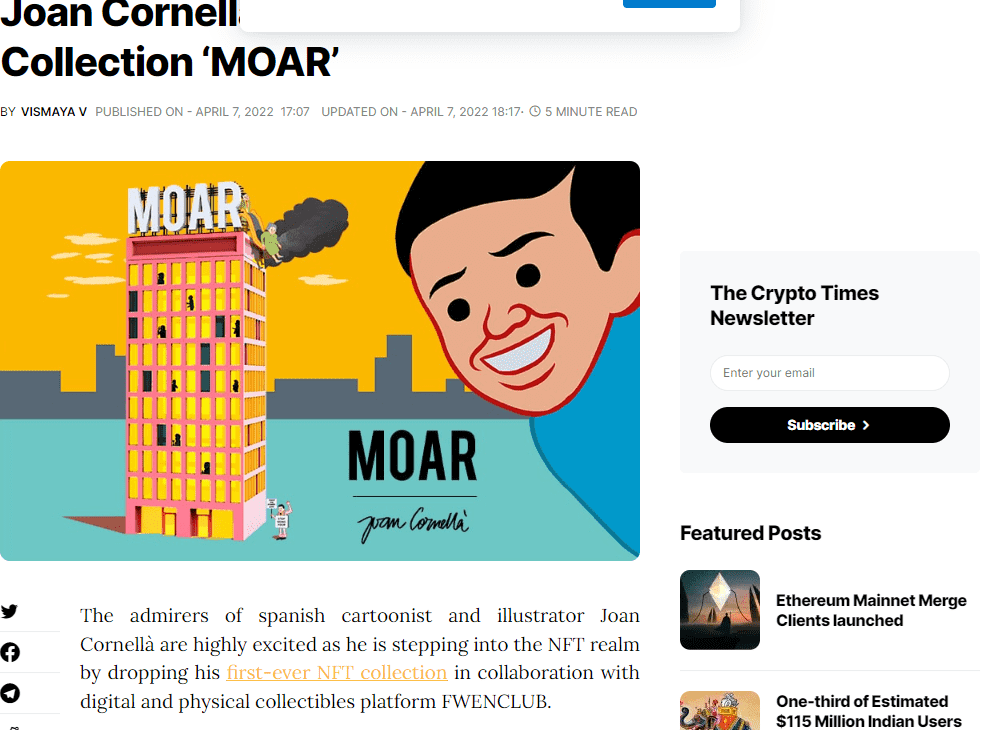

# MOAR by Joan Cornella

在摩尔街 0 号的一座豪宅中，一群独特的生物和平地生活在一起，而世界其他地方则因外星人入侵而处于封锁状态。这座不寻常的豪宅在虚拟世界中设有一些商店、游戏和展览。这是 Joan Cornellà 的第一个 NFT 系列，他邀请您来成为 MOAR 的客人。MOAR NFT 系列于 2022 年 4 月推出，现在仅在二级市场上发售。MOAR #1 通过拍卖发行，最终以 46 ETH 收盘。随后，该团队宣布所有收益将用于 DAO 开发。对于其他 5,554 个 NFT，21% 首先释放到白名单账户，然后通过荷兰式拍卖向公众释放 74%。剩下的 5% 留给 FWENCLUB 团队和艺人。持有人可以期望获得艺术家的实体和虚拟展览，以及他的作品的独家购买权。此外，持有者还将有机会获得元界 3D 头像的空投。到目前为止，持有者已经获得了MOAR手机壳等各种社区奖励。目前，一些小游戏已经在筹备中。这些游戏仅供 MOAR NFT 持有者使用，玩家将获得免费的 Joan 空投。这些游戏应该会在 2022 年 5 月发布，而空投将在 2022 年 6 月。此外，元宇宙就绪版本将在 2022 年 7 月推出。显然，接下来的几个月对于社区来说将是超级激动人心的。

到今年年底，琼正计划组织一次 MOAR 虚拟展览。这应该是值得期待的事情。然而，MOAR NFT 绝对不适合所有人，有些人甚至称其为冒犯性和不必要的。好吧，我猜每个人都有自己的想法。

哦，对了，Animoca Brands 的[Yat Siu](https://nftevening.com/animoca-brands-chairman-yat-siu-just-bought-a-moar-nft/)几天前刚加入 MOAR NFT 大家庭。也许是一个看涨信号？

