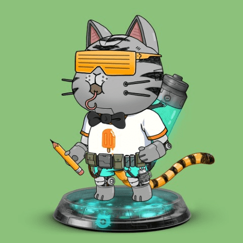

# NANOCATS

第一个 CATBOTICA NFT 系列包含来自 Neilos 星球的 12,000 个 Catbots，现在驻留在以太坊区块链上。Nanocats [ NV1s / NV2s ]分为两个发布阶段和品种，将允许用户创建和升级 3D 资产。也可以保留以备将来使用。Metaverse 就绪、完全装配的 3D Catbot NFT。可通过燃烧 Nanocats [NV1s / NV2s] 生成 - 日期待定。Nanocats 是纳米级的 catbots，可帮助构建、升级和修复 Catbot 单元以及其他机械结构、车辆和机器人。Nanocats 1.0 版被称为 NV1。(Nanocat Vatpack 01) NV1 可用于将 Catbotica 2D Genesis Catbots 升级为 3D Catbots（复制版）。Replicat 是 2D Catbot 的 3D 副本。Replicat 将具有与您的 2D Catbot 完全相同的特征，而基本特征将决定您的 3D Replicat 的表面。如果您选择保留这些有限的 NV1 供应，您或许可以升级未来的 3D Catbotica 资产。 

