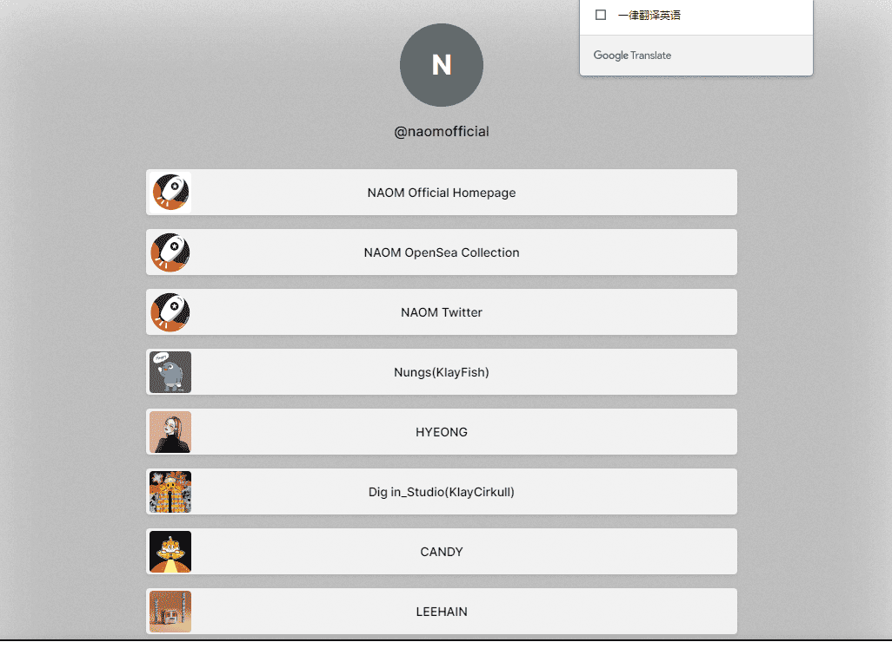

# NAOM_OFFICIAL

aom项目的意义在单写者难以生存的 NFT 市场，10 位单写者一个旨在支持和共同成长的社区 1.开启联合收藏- 10 位作者各种内容 NFT 出版物 ex) Relay webtoon..社区网站创建成立Naom Community Decobang & Okabang 各种活动即将推出 WL 是 Naom Writers购买 NFT 可享受 10% 的折扣（WL条件：拥有Naom艺术家10多件作品）+划分WL级别并应用不同的好处（例如青铜，白银，黄金...... ）

 Goods Shop - 从 Naver Smart Store 开始。商品商店网页计划在未来开放。线下展览 支持合作艺术家实现路线图的利润 新增 NFT writer 支持项目

