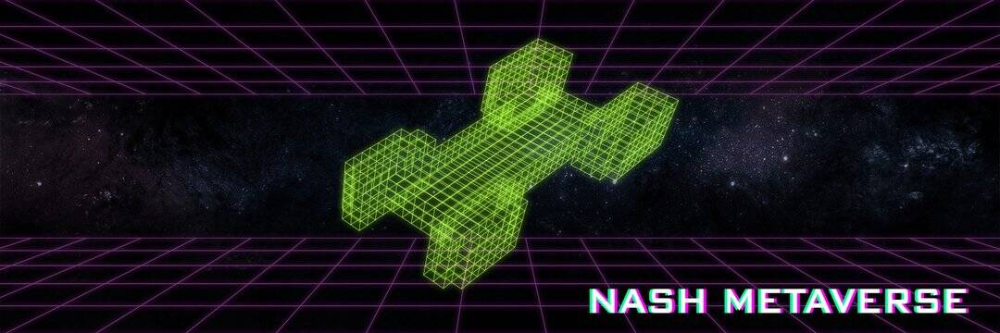

# NASH Metaverse

NASH元界是一个多元化、兼容的加密元界，具有包括沉浸式游戏、灵感创造和社区发展的全生命周期。这是一个社区驱动的虚拟世界，玩家可以在其中创造历史、创建内容和构建资产。

NASH元界是一款太空游戏，玩家可以购买NFT飞船，参与“教育模拟”、“MMO”、“卡牌游戏”、“动作游戏”等不同的游戏。NASH 元界通过 NFT 重塑游戏，让玩家在 NASH 元界中创造和获取价值，开发者可以专注于开发有趣的游戏来捕捉玩家的价值。

NASH Meta Universe 在 Dorahacks 举办的 ETH Hackthon 中获得冠军。本次大赛共有19个项目，共获得11207票，社区捐赠334.9665个BNB。其中，NASH Protocol Meta Universe 获得了 2193 票，是社区投票中最高的，同时也获得了社区捐赠的多达 123 个 BNB。
