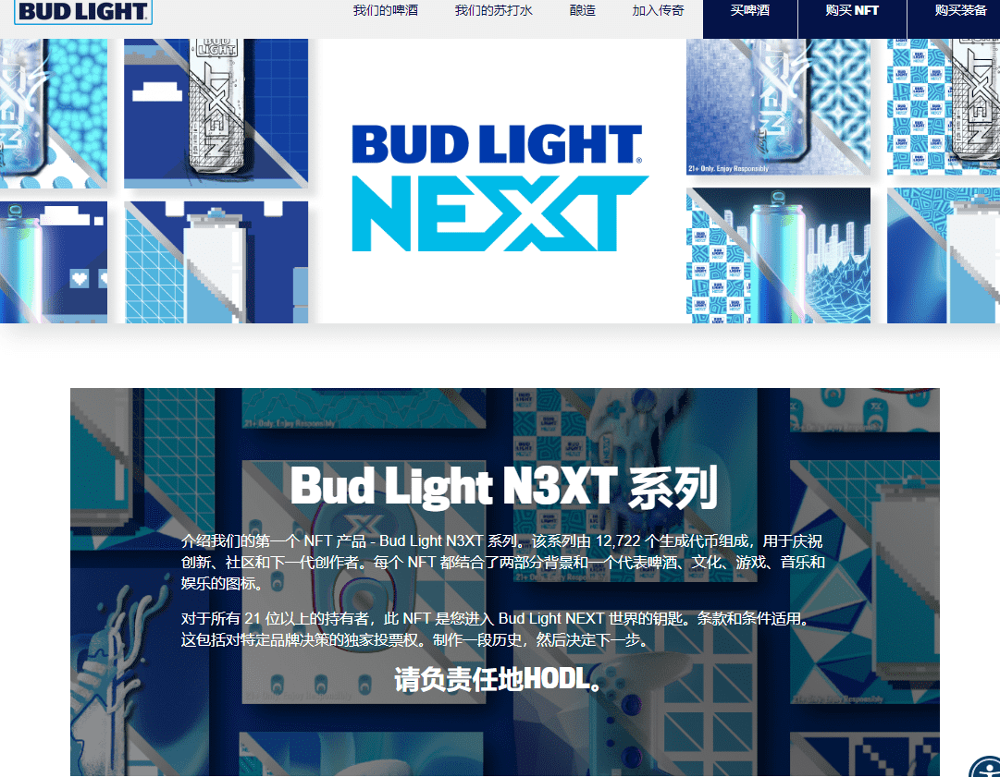

# National Beer Day 2022 - Cheers

绍我们的第一个 NFT 产品 - Bud Light N3XT 系列。该系列由 12,722 个生成代币组成，用于庆祝创新、社区和下一代创作者。每个 NFT 都结合了两部分背景和一个代表啤酒、文化、游戏、音乐和娱乐的图标。对于所有 21 位以上的持有者，此 NFT 是您进入 Bud Light NEXT 世界的钥匙。条款和条件适用。这包括对特定品牌决策的独家投票权。制作一段历史，然后决定下一步。ANHEUSER-BUSCH 致力于为所有用户（包括残障人士）改善我们网站的可访问性。如果您因残疾而在访问我们网站上的任何信息时遇到问题或困难，我们希望收到您的来信。请通过与我们联系，并提供您的联系信息、您遇到问题的网址以及问题的简要说明。此电子邮件地址仅用于与可访问性相关的查询。如果您有不相关的投诉或反馈，请访问我们的

