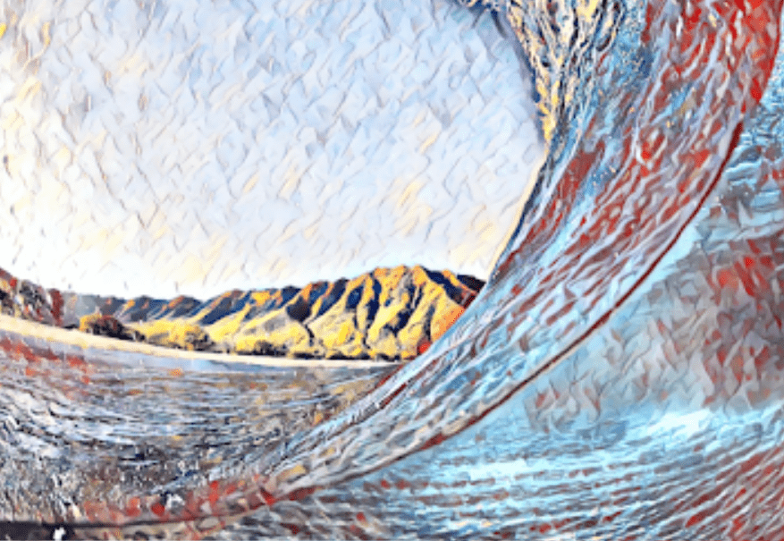

# Nature by Hokusai

北斋是一个仔细而敏感的*自然*世界和人类在其中的位置的观察者，他似乎暗示的一个地方永远不会......对于日本艺术家葛饰*北斋*来说，生活和艺术都以非凡的*自然*力量为标志。他的妻子和两个孩子……我一直是日本艺术家北斋的粉丝*，*尤其是他对牟.流水、巨浪、圣山：176幅*北斋*版画展示了艺术家对运动和设计的掌握。人类永远处于忘记他们在*自然界*中真正不相关的位置的风险中。我们忽略了我们的无能为力和...我讲过巨浪，或者更确切地说，讲过卢坎启示录：“太阳、月亮和星星的迹象。. . 因大海的咆哮和波浪而迷惑的国家之间的苦难”（路加福音 21.25）。*巨浪是世界上**最* 着名的图像之一，它描绘了富士山被汹涌的水波高耸入云，而处于危险中的船夫则从他们脆弱的手工艺品中茫然地凝视着。

