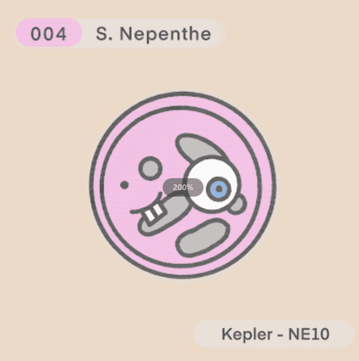

# NE_10

*NE_10*是一个 NFT（Non-fungible token）集合。存储在区块链上的数字艺术品集合。▷ 有多少*NE_10*代币？总共有 什么是 NE_10？NE_10 是一个 NFT（Non-fungible token）集合。存储在区块链上的数字艺术品集合。NE_10 代币有多少？总共有 20 个 NE_10 个 NFT。目前 7 位所有者的钱包中至少有一个 NE_10 NTF。最近卖出了多少NE_10？过去 30 天内售出 0 NE_10 个 NFT。如果您想找到最好的 NFT 购买、即将推出的 NFT 项目、最昂贵的 NFT 是什么——我们将为您提供您需要的数据、图表、见解和新闻。

