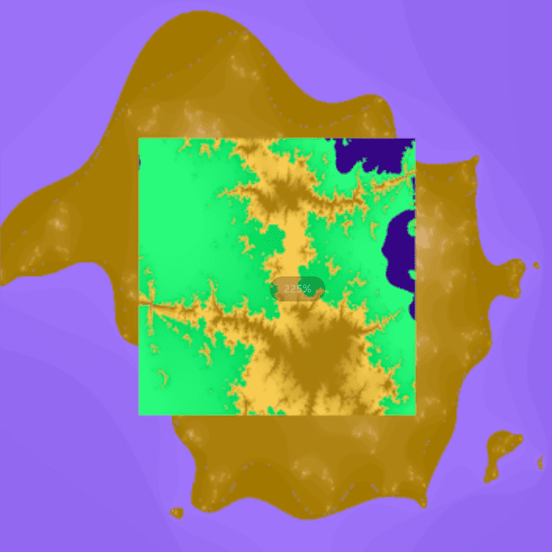

# Nebula Fractals

2500 个具有爆炸性增强功能的生成星云分形。星云分形是通过 MANOWAR 增强生成的，这是一种具有曼德布洛特-朱莉娅系列特征的特殊分形。2021 年 8 月 1 日—滚动查看更多。前面一个后面一个。*星云分形*。亲100ker。学生 3d 艺术家 | 分形艺术家。跟随。喜欢。添加到收藏 ..*Fractal Nebula*是 Dj Abralabim 的创意，他是这个场景中最狂热的迷幻音乐收藏家之一作者：S Datta · 2003 ·被引用次数：16 —这提供了令人信服的证据，表明马头*星云*的结构不仅是*分形*的，而且它的几何形状可以通过...2500 个*具有爆炸性增强功能的生成星云分形*。*星云分形*是通过MANOWAR增强生成的，这是一种特殊的分形，具有..

