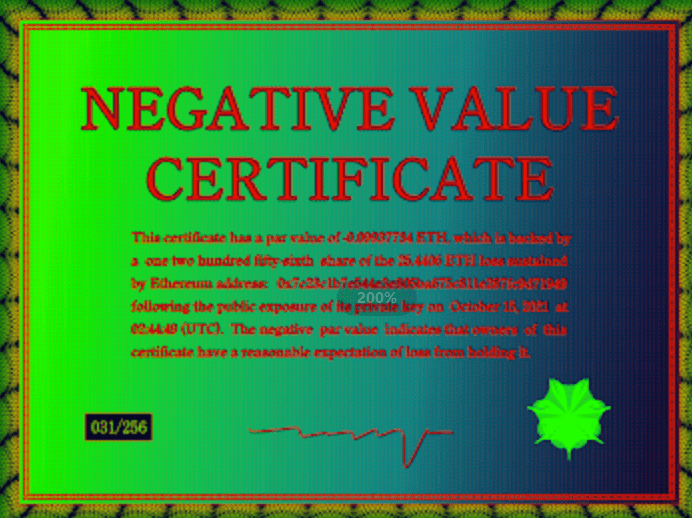

# Negative Value Certificates

每张负值证书的面值为 -0.09937734 ETH，由以太坊地址：0x7c23c1b7e544e3e805ba675c811e287fc9d71949 于 2021 年 10 月 15 日公开曝光后的 25.4406 ETH 损失中的 1256 分之一提供支持02:44:49 (UTC)。虽然证书持有者可能会以高于购买价格的价格出售该代币，但负面值表明他们没有合理的利润预期，事实上，他们有合理的亏损预期。证书不可撤销、不可赎回，并且不可兑换货币或非货币补偿。所有证书都是通过受损的钱包铸造的，该钱包负责丢失作为真实性的证明。虽然证书持有者可能会以高于购买价格的价格出售该代币，但负面值表明他们没有合理的利润预期，事实上，他们有合理的亏损预期。

