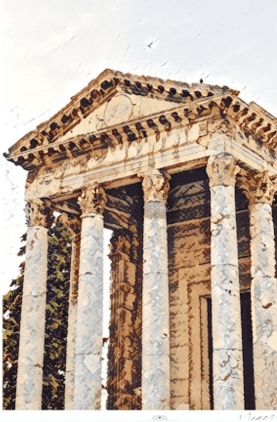

# Negev Genesis

negev 的第一个系列 negev 的第一个系列。... 再次按空格键将项目放到新位置，或按退出键取消。*内盖夫创世纪*。分享。more_horiz ...内盖*夫*或内盖布是以色列南部的沙漠和半沙漠地区。...在被驱逐出埃及后*在内盖夫呆了一段时间（创世记*13:1,3）。他从*内盖夫继续前行*，沿途露营，到伯特利，他第一次在伯特利和艾城之间搭起帐篷，并建造了他的第一座祭坛。于是亚伯兰带着他的妻子和他所有的一切，从埃及上到了*内盖夫，罗得也跟着去了。*于是亚伯兰和他的妻子，以及众人从埃及上来……从*内盖夫*，他从一个地方到另一个地方，直到他来到伯特利，到伯特利和艾城之间的地方，他的帐棚早先在那里，也就是他所在的地方

