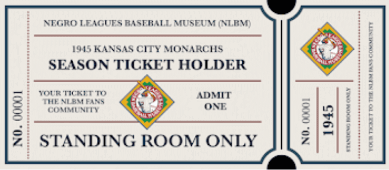

# Negro League Baseball Fans

黑人联盟棒球博物馆 (NLBM) 庆祝 1945 年堪萨斯城君主队的历史意义，这是杰基罗宾逊在球队的一年。加入这个独家社区将让您访问独家博物馆内容，邀请参加社区活动，并巩固您自己在区块链历史上的特殊地位。NLBM 是世界上唯一一个专门致力于保存这一令人难以置信的历史的博物馆，作为一个私人资助的非营利组织，它需要您的支持来继续教育后代。这个独家系列一定会成为所有棒球迷的本垒打，无论老少！

