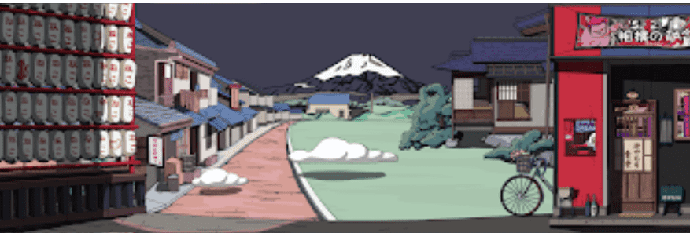

# Nekomura

一天下午，我正在帮助一部中国电影进行艺术创作。我被要求一次又一次地修改手稿。内心的撕裂感和无助感再次涌上心头。这不是我第一次计划逃离这种该死的生活环境并找到一份舒适的工作，以结束这种受他人摆布的精神生活。创始人中午做了一个梦，梦见猫村！马上开始了大 5555 横幅 NFT 的工作无论是从构图、配色、光线、质感等方面，真正的想法是通过融合心灵的想法来呈现出优质的作品。他们是一支尽职尽责、敬业的营销团队，致力于将客户感知价值放在首位。为热爱猫村的人们创造舒适、温暖的社区

