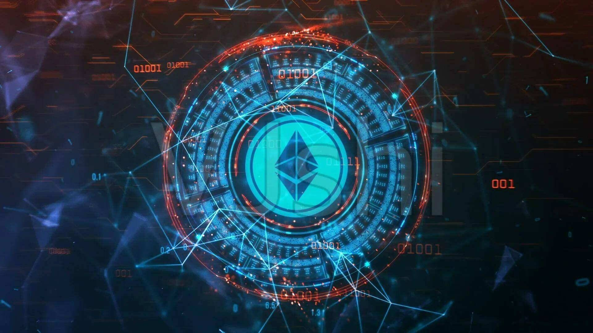

# NEL HYDROGEN NEXT EVOLUTION LEVEL

我们将两个世界的技术连接起来 氢技术和区块链在这个项目中首次在这里连接，并连接到一个不断增长的生态系统，以结合两个世界的优势。Alternative Fueling Station Locator 应用程序可帮助您找到提供电力、天然气、生物柴油、乙醇 (E85)、丙烷和氢气的加油站。

我们正在建立一个合作伙伴网络，他们也将接受加密技术和区块链作为支付方式。因此，您不仅可以使用我们的应用程序查找下一个加油站的替代驱动器类型，还可以使用加密技术进行支付。在这里，您现在可以使用任何被接受的加密货币，当然也可以使用 NEL 代币，您可以使用它获得关联业务合作伙伴总价 10% 的额外折扣。

