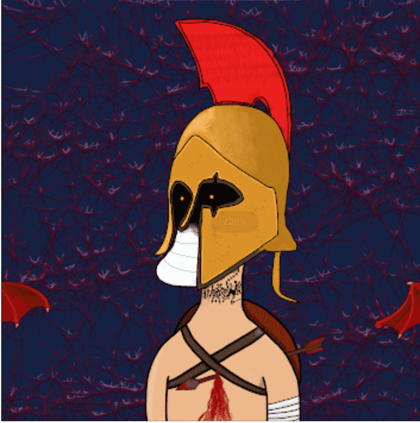

# Nelman's Union

*Nelman's Union*是 1,000 个 Nelman NFT 的集合——以太坊区块链中的独特数字收藏品。您的 Nelman 不仅是独一无二的...*Nelman's Union*是一个 NFT（Non-fungible token）集合。存储在区块链上的数字艺术品集合。▷ 有多少*Nelman's Union*代币？在艺术家*内尔曼*。发布。5.16 美元。长度 7:00; 2020-05-15 发布；BPM 140 ... *Union* Space 原创混音 · Alex Progress。1.29 美元。邂逅原创混音。要成为会员，请在 OpenSea 上购买 Nelman：我们现已上线并可供购买！请不要忘记刷新 OpenSea 上的元数据以确保图像和属性显示！

