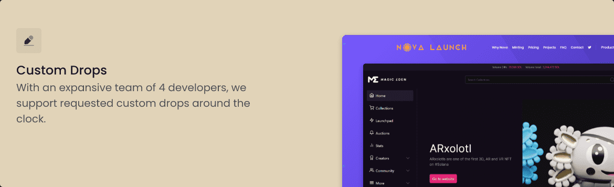

# Nemesis Bot

Nemesis 是最先进的 NFT 机器人应用程序。支持 ETH Mint、Solport、MonkeLabs、CMV2、MagicEden 和自定义签名 ETH 掉落。自 2021 年 12 月以来，Nemesis 一直在运作并持续打击最严重的 NFT 跌幅。

支持的模块： Ethereum Mint Custom Signature Ethereum Mint CMV2 Mint Civic Mint MonkeLabs Mint MagicEden Launchpad NEAR Mint MagicEden Sniper OpenSea Sniper MagicEden On-chain Sniper OpenSea On-chain Sniper最快的多功能“机器人”，内置自动铸造、狙击和列表。

由我们建造；被你做得更好。从那时起，我们收集了所有的用户反馈并完全重新制作了我们的软件，使其成为同一个动物但不同的野兽。Nemesis 自 2021 年 12 月以来一直公开露面。受其他利基市场使用的实践的启发，我们引入了该空间中存在的最现代的 UI。

