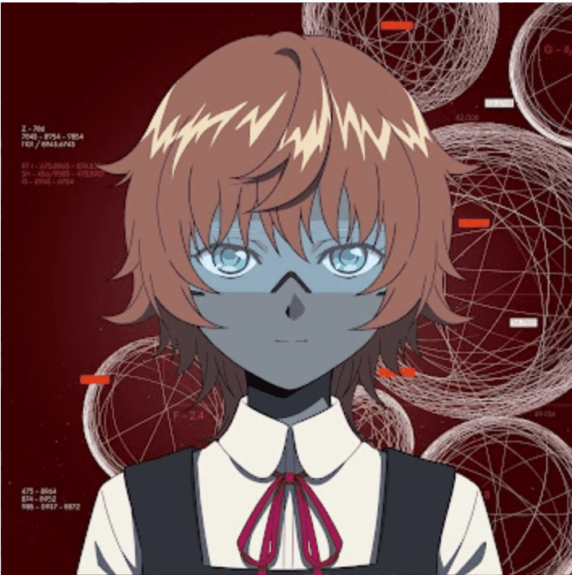

# NEN STUDIO

NEN是一个面向链上的AI角色品牌。NEN 专注于动画，并使用 AI 技术创建角色内容。作为一个品牌，它继续取得重大进展。我们的目标是聚集一个热爱科幻小说的 NFT 持有者社区，共同创作我们自己的科幻小说。3000 个生成 NFT。没有最高购买限制。但是，每笔交易的 MINT 限制为 1。
由于取消响应等原因，剩余数量可能会增加或减少。NEN是一个面向链上的AI角色品牌。

NEN 专注于动画，并使用 AI 技术创建角色内容。
作为一个品牌，它继续取得重大进展。
NEN 旨在根据 NFT 持有者的身份几乎在链上生成 AI 字符。
您可以自由回答为将要
生产的 3000 个 NFT 设置的问题。这样做，您的答案或“身份”将永远存储在链上。
然后，这些身份将影响我们创建的 AI 角色的对话内容和思想。

