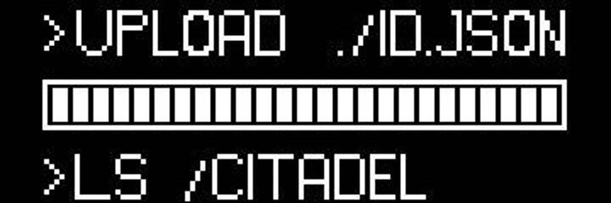

# Neo Tokyo Identities

Neo Tokyo 系列的 NFT 对于大多数藏家来说应该是又熟悉又陌生，熟悉的原因是近两个月，在 OpenSea 的 Rank 排行榜中经常出现这一系列的身影，价格最高的 Citzens 系列地板价约为 50ETH，一度超过 BAYC 的地板价，最便宜的 item catches 系列也要 3.5ETH。陌生的是因为人们对这个代码式的 NFT 一无所知，社区更是神秘，让人们无从谈起。

Neo Tokyo Outer Identities 的系列通过解谜发售，在二级市场 OpenSea 一个小时间地板价格从 3ETH 飙升到 6ETH 左右才引得些许关注，而是关注的原因也非常简单「又贵又看不懂」。

**Neo Tokyo Identities-隐秘的身份**

Neo Tokyo 系列虽然神秘低调，相反两位创始人却都赫赫有名。Alex Becker 作为 Crypto 领域的知名 Kol，其推特拥有 61 万的关注者，YouTube 拥有 113 万订阅，Alex Becker 同时也是智能广告追踪公司 HYROS 的 CEO。另一位创始人 EllioTrades 同样也是 Crypto 领域的 Kol，推特粉丝 57.5 万，YouTube 有超过 56 万订阅粉丝。

Ellio Trades 在一次直播活动中连线了 Alex Becker，两人都对 GameFi 与 NFT 领域有极大的兴趣，并且提出了非常多新颖的观点。经过几次的沟通便决定着手开启名为 Neo Tokyo 的元宇宙游戏项目。
