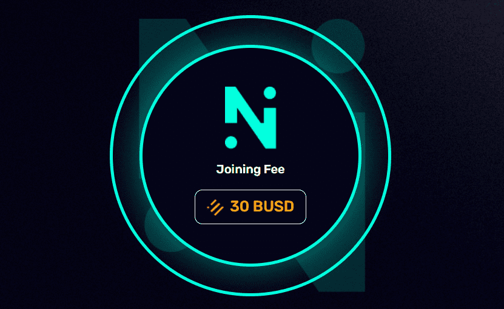

# Neom harvest

Neom Harvest 是一个基于智能合约的去中心化参与式会员传销平台。NEOM HARVESTii 是下一代全球社区计划，也是 BSC 上首个此类智能配方。这是一个单线会员计划。新参与者以及重新定位自己的参与者将自动放置在此上线的结构中，在最近的空闲位置。一个有效的参与式推荐系统，合作伙伴从先前定位的上线开始均匀分布在整个系统中。代码在公共领域。交易信息可以在区块链上查看。

