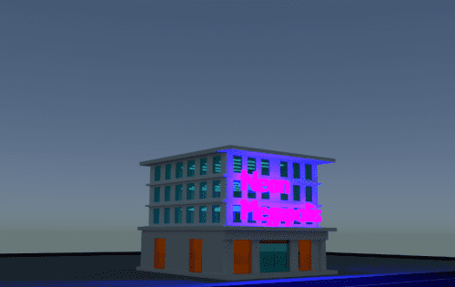

# Neon Megapolis NFT

Neon Megapolis 是第一个由 Polygon 网络提供支持的虚拟城市之一，专为 Metaverse 构建，由创新技术设计。

我们的未来城市是由存储在区块链上的属性设计的。每个可收藏的 ERC-721 (NFT) 代币的所有者和特别命名的

(NMFT)，最大供应量为 30507，拥有这些房产的所有权并拥有对内部和外部内容的控制。负责 NFT 的正确分配，它们的创建和应用，由基于多边形网络的智能合约执行，可以公开看到，在业主可以建造公寓、办公室、3D 虚拟商店体验。

Neon Megapolis 也是一个用于个人空间、购物和商业的 AR/VR 和 3D 平台。每个属性（建筑物）都是一个元数据容器，具有特定的地理位置、高度、宽度，足以建造允许的楼层。可以复制任何对象、场景、艺术或音乐，每个所有者将有多种选择来代表他的想法或业务。 

Neon Megapolis 可以是一个工作场所，因此业主可以招募人员在各种项目中工作。例如，也可以对非玩家角色 (NPC) 进行编程以在您的商店工作以代表您的产品。您的公寓的室内设计，您可以邀请同事、朋友、玩游戏、玩得开心，也将成为主要娱乐活动的一部分。约会俱乐部、聊天、口头交流、虚拟酒吧、迪斯科舞厅、VR 中呈现的休闲区将可用。

