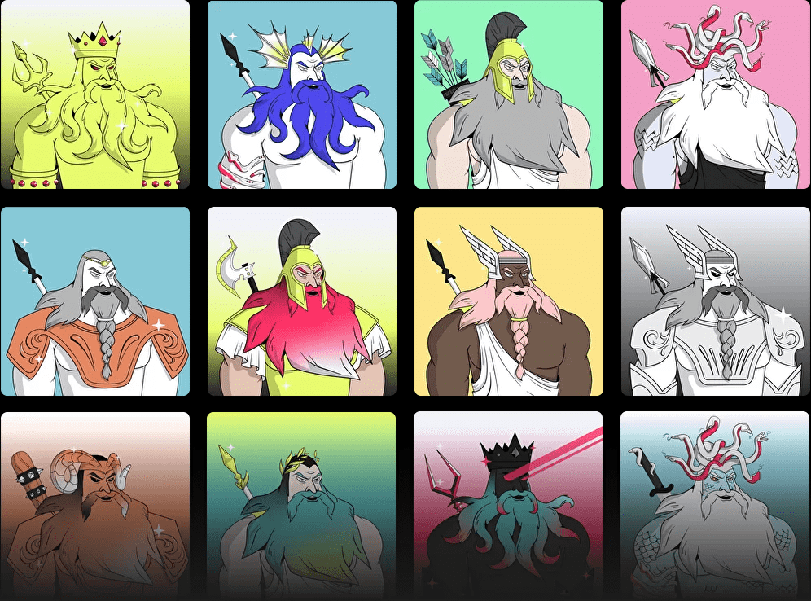
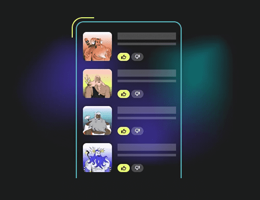

# Nereus

Nereus是一个分散的非托管流动性市场协议，用户可以作为储户或借款人参与。储户向市场提供流动性以赚取被动收入，而借款人可以以过度抵押（永久）或欠抵押（一次性流动性）的方式借贷。Nereus经过优化，以提供动态和固定利率，同时降低抵押品要求，重点关注交易和价格投机以外的用例。

## 跟踪 WXT

Nereus 奖励活跃用户。您与协议的交互越多，您获得的收入就越多——就这么简单。贷方和借方都产生 WXT 奖励（受制于 3 个月的背心）。

作为市场上最灵活的实用代币，WXT 的设计考虑了未来和主流采用。它使用户能够获得前所未有的兴趣，以前所未有的方式分享收入并产生下一代加密奖励。WXT 已被全球 450 万人使用，它是释放 DeFi 力量的关键。

## 锁定或质押您的 WXT

质押者赚取协议费用。储物柜从提早退出背心的用户那里获得协议费用和退出罚款。

## 海神变形者

与古老的海神 Nereus 一起了解深海的秘密（以及 Nereus 金融协议上独特的 Defi 特权），他以改变形状并将真理和智慧带给世界的能力而闻名。改变你的形状，分享你的预言的力量。

## 收藏品

Nereus Shapeshifters 是 10,000 个随机生成的 NFT 的集合。每个 Shapeshifter 都是独一无二的，并奖励持有者在 Nereus Finance 协议上享有独家利益和投票权。

## 代币经济学

除了您自己独特的 Shapeshifter 化身和炫耀它的权利之外，Shapeshifters 还有权参与 Nereus 协议治理并解锁可以增加您的奖励的独家特权。

## 稀有度

海神变形者中有 66 个特征。虽然海神星上的所有变形者都受到平等对待，但有些人比其他人稀少得多。你会找到十个传奇变形者之一，每个都有自己独特的力量吗？

