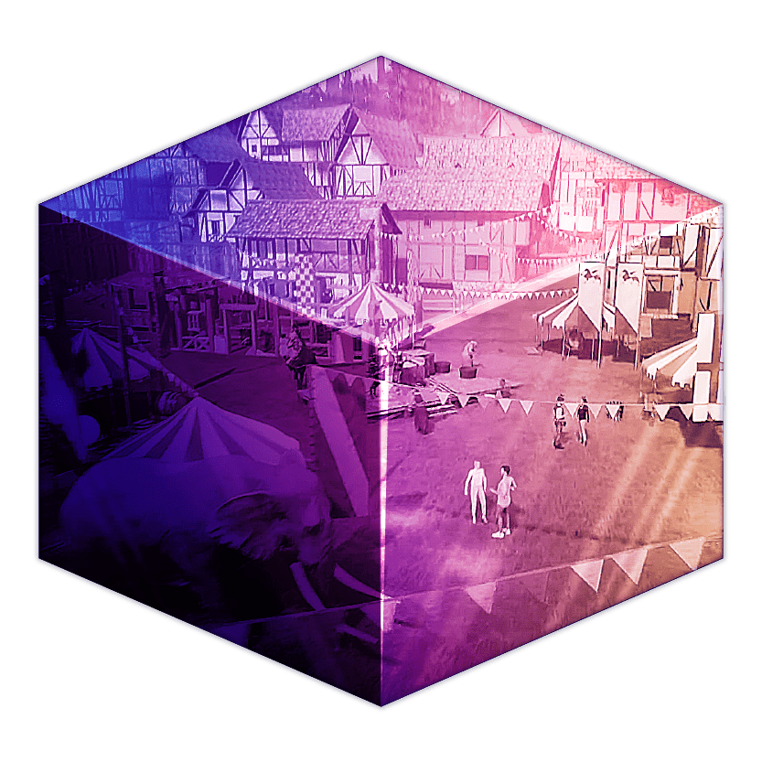

# NetVRk

Netvrk是基于虚幻引擎构建的多链元宇宙，具有强大的创作工具和基础设施，可轻松创建、分享、体验和货币化创作。专注于游戏、教育和电子商务，所有这些都围绕虚拟土地和资产的所有权而建立。

## 虚幻引擎

选择虚幻引擎是因为它具有无与伦比的图形功能，以及它的扩展能力。其高保真度和丰富的特性为区块链元界提供了完美的基础。虚幻引擎越来越多地用于电影和电视行业、建筑、模拟、现场活动、扩展现实 (XR)，当然还有游戏。随着最近虚幻引擎 5 的发布，现在可以实现逼真的图形。谈到 Netvrk 在虚幻引擎上构建的能力，天空就是极限。

## 多链元界

Netvrk 将在其 Metaverse 中集成和支持多个区块链，包括**Ethereum、Polygon、Avalanche、Solana、Cardano、Polkadot、BSC Chain、XRPL、Flare、Elrond、Phantasma、Hedera**等。为了建立一个真正的元宇宙，我们支持大量的区块链是很合适的，每个区块链都有自己的优势、社区和能力。

利用 API 和后端集成，来自上述任何区块链的项目将能够无缝集成到 Netvrk Metaverse。

## 代币生态系统

NetVRk 代币使用案例

### 购买资产

NETVRK 代币可用于在您所在的虚拟现实世界中购买资产。资产可以包括建筑物、车辆、房屋以及 NETVRK 市场中的许多其他资产。买地

就像线下世界一样，土地也是网易VR世界的宝贵商品。代币可用于购买主要房地产热点的土地，例如俯瞰海滩或城市前方。

### 购买广告空间

NTVRK 代币可用于购买广告空间，可用于产生某种形式的被动收入并出售给其他方以获得可观的利润。

### 生成 NFTS

该代币还可用于生成不可替代代币 (NFT)，这是另一种赚取额外收入的方式。

### 质押

使用 NTVRK 代币赚取被动收入的另一种方式可以通过质押来完成，根据在网络中质押他们的代币，向质押者支付固定百分比的利润。
